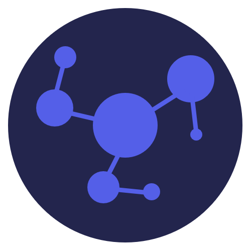

<a name="readme-top"></a>

<!-- PROJECT SHIELDS -->
[![Contributors][contributors-shield]][contributors-url]
[![Forks][forks-shield]][forks-url]
[![Stargazers][stars-shield]][stars-url]
[![Issues][issues-shield]][issues-url]
[![MIT License][license-shield]][license-url]
[![LinkedIn][linkedin-shield]][linkedin-url]

<!-- PROJECT LOGO -->
<br />
<div align="center">
  <a href="https://github.com/jamestkelly/decider">
    
  </a>

<h3 align="center">Decider</h3>

  <p align="center">
    A progressive web application (PWA) for coming to a consensus on decisions, complaints and suggestions sharing, and creating events.
    <br />
    <a href="https://github.com/jamestkelly/decider"><strong>Explore the docs »</strong></a>
    <br />
    <br />
    <a href="https://github.com/jamestkelly/decider">View Demo</a>
    ·
    <a href="https://github.com/jamestkelly/decider/issues">Report Bug</a>
    ·
    <a href="https://github.com/jamestkelly/decider/issues">Request Feature</a>
  </p>
</div>

<!-- TABLE OF CONTENTS -->
<details>
  <summary>Table of Contents</summary>
  <ol>
    <li>
      <a href="#about-the-project">About The Project</a>
      <ul>
        <li><a href="#built-with">Built With</a></li>
      </ul>
    </li>
    <li>
      <a href="#getting-started">Getting Started</a>
      <ul>
        <li><a href="#prerequisites">Prerequisites</a></li>
        <li><a href="#installation">Installation</a></li>
      </ul>
    </li>
    <li><a href="#usage">Usage</a></li>
    <li><a href="#roadmap">Roadmap</a></li>
    <li><a href="#contributing">Contributing</a></li>
    <li><a href="#license">License</a></li>
    <li><a href="#contact">Contact</a></li>
    <li><a href="#acknowledgments">Acknowledgments</a></li>
  </ol>
</details>

<!-- ABOUT THE PROJECT -->
## About The Project

[![Product Name Screen Shot][product-screenshot]](https://decider.web.app)

Decider (the name is a work in progress), is a progressive web application (PWA) intended for the following purposes:

- Coming to a consensus on decisions, e.g., you can post items and have your team, housemates, partner and so on vote
  on options linked to the given item.
- A _spin the wheel_ or other randomised selection tools, the results of which you can then share with others.
- A page for _optionally_ anonymous submissions, i.e., you can post complaints about someone not doing the dishes in the
  household on a regular basis or _ideally_ suggestions for improvements for your team like, we should implement
  flexible working hours.
- Event creation, a stand-alone event creation tool that can send invitations via email to people's calendars.

Decider aims to be able to have the same functionality for both anonymous and registered users, whereby you can either
link a team, group, relationship, via a _shared_ user access code and password, or have registered members to a group.
This application has been built using a Golang backend with Firebase Hosting & Realtime Database alongside Google Cloud
Platform, a React TypeScript front-end with Ionic for mobile application development.

The complete design of the solution can be seen as hosted on [Figma](https://www.figma.com/file/G71lWR7qZvZgSm7m8tTre4/Decider-v1?node-id=0%3A1&t=RjmxLgjzyk9ZGLXA-1).

<p align="right">(<a href="#readme-top">back to top</a>)</p>

### Built With

* [![React][React.js]][React-url]
* [![Ionic][Ionic.dev]][Ionic-url]
* [![Go][Golang.go]][Go-url]
* [![Firebase][Firebase.dev]][Firebase-url]
* [![Google Cloud Platform][gcp.dev]][gcp-url]
* [![Docker][Docker.dev]][Docker-url]

<p align="right">(<a href="#readme-top">back to top</a>)</p>

<!-- GETTING STARTED -->
## Getting Started

### Prerequisites

Given `Decider` is a React TypeScript application that utilises a Golang API server, it is assumed that the following
is installed in your development environment.

- `Node.js`: `^v18.0.0`
- `Go`: `^v1.20.3`

### Installation

In the event you do not have the base prerequisites installed, please refer to the following links:

- [Node.js](https://nodejs.org/en)
- [Go.dev](https://go.dev/)
- [Docker](https://www.docker.com/)
  - **Note:** On MacOS devices, I personally recommend using [Orbstack](https://orbstack.dev/) as an alternative to
    Docker desktop. 

From there, you can follow the steps below to run the application on your local machine.

1. Generate application credentials on [Firebase](https://firebase.google.com/) and note them down. You'll require both
    the Admin SDK credentials and the standard Firebase credentials.
2. Copy the template `.env.template` and `firebaseCredentials.template.json` files to the same location (without the
    `.template` part).

  ```shell
  # From the root of the repository
  cd client && cp .env.template .env && cd ../
  cd api && cp .env.template .env && cp firebaseCredentials.template.json firebaseCredentials.json && cd ../
  ```

3. Populate the environment files with relevant keys and details.
4. Navigate to the `client` directory and install the `npm` packages.

  ```shell
  cd client
  npm install
  ```

5. Navigate to the `api` directory and install the `go` packages.

  ```shell
  cd api
  go install
  ```

Once you have finished the steps above, you should be fine to run the application and API locally as per the
instructions in the [Usage](#usage) section.

<p align="right">(<a href="#readme-top">back to top</a>)</p>

<!-- USAGE EXAMPLES -->
## Usage

1. Navigate to the `client` directory and run the client application.

  ```shell
  cd client
  npm start
  ```

2. Navigate to the `api` directory and run the API server.

  ```shell
  cd api
  go run main.go
  ```

TODO:

- Add docker execution steps.

_For more examples, please refer to the [Documentation](https://github.com/jamestkelly/decider)_

<p align="right">(<a href="#readme-top">back to top</a>)</p>

<!-- ROADMAP -->
## Roadmap

- [x] Project initialisation & creation
- [x] Front-end and architectural design
- [ ] Back-end implementation
  - [ ] Golang API server
- [ ] Front-end implementation
  - [ ] Basic website build
  - [ ] Mobile application build
- [ ] Hosting
  - [ ] Application hosted and served via cloud-based platform (GCP)
- [ ] Private alpha access and testing
- [ ] Public beta access
- [ ] Release onto mobile application stores

See the [open issues](https://github.com/jamestkelly/decider/issues) for a full list of proposed features (and known issues).

<p align="right">(<a href="#readme-top">back to top</a>)</p>

<!-- CONTRIBUTING -->
## Contributing

Contributions are what make the open source community such an amazing place to learn, inspire, and create. Any contributions you make are **greatly appreciated**.

If you have a suggestion that would make this better, please fork the repo and create a pull request. You can also simply open an issue with the tag "enhancement".
Don't forget to give the project a star! Thanks again!

1. Fork the Project
2. Create your Feature Branch (`git checkout -b feature/AmazingFeature`)
3. Commit your Changes (`git commit -m 'Add some AmazingFeature'`)
4. Push to the Branch (`git push origin feature/AmazingFeature`)
5. Open a Pull Request

<p align="right">(<a href="#readme-top">back to top</a>)</p>

<!-- LICENSE -->
## License

Distributed under the MIT License. See `LICENSE.txt` for more information.

<p align="right">(<a href="#readme-top">back to top</a>)</p>

<!-- CONTACT -->
## Contact

Jim T Kelly - [jimkelly.t@outlook.com](mailto:jimkelly.t@outlook.com)
<!-- TODO: Add Cristian & Patrick's contact details here (if they want) -->

Project Link: [https://github.com/jamestkelly/decider](https://github.com/jamestkelly/decider)

<p align="right">(<a href="#readme-top">back to top</a>)</p>

<!-- ACKNOWLEDGMENTS -->
## Acknowledgments

Thank you to the following for their guides and articles on similar projects.

* [Build A Go REST API, React.js & TypeScript Todo Application - TomDoesTech](https://www.youtube.com/watch?v=QevhhM_QfbM)
* [A Golang + ReactJS Application - Madhan Ganesh](https://medium.com/@madhanganesh/golang-react-application-2aaf3bca92b1)
* [Serve Dynamic Content and Host Microservices with Cloud Run](https://firebase.google.com/docs/hosting/cloud-run)

<p align="right">(<a href="#readme-top">back to top</a>)</p>

<!-- MARKDOWN LINKS & IMAGES -->
<!-- https://www.markdownguide.org/basic-syntax/#reference-style-links -->
[contributors-shield]: https://img.shields.io/github/contributors/jamestkelly/decider.svg?style=for-the-badge
[contributors-url]: https://github.com/jamestkelly/decider/graphs/contributors
[forks-shield]: https://img.shields.io/github/forks/jamestkelly/decider.svg?style=for-the-badge
[forks-url]: https://github.com/jamestkelly/decider/network/members
[stars-shield]: https://img.shields.io/github/stars/jamestkelly/decider.svg?style=for-the-badge
[stars-url]: https://github.com/jamestkelly/decider/stargazers
[issues-shield]: https://img.shields.io/github/issues/jamestkelly/decider.svg?style=for-the-badge
[issues-url]: https://github.com/jamestkelly/decider/issues
[license-shield]: https://img.shields.io/github/license/jamestkelly/decider.svg?style=for-the-badge
[license-url]: https://github.com/jamestkelly/decider/blob/master/LICENSE.txt
[linkedin-shield]: https://img.shields.io/badge/-LinkedIn-black.svg?style=for-the-badge&logo=linkedin&colorB=555
[linkedin-url]: https://linkedin.com/in/jimkellyt
[product-screenshot]: resources/img/product/product-screenshot-desktop.png
[React.js]: https://img.shields.io/badge/React-20232A?style=for-the-badge&logo=react&logoColor=61DAFB
[React-url]: https://reactjs.org/
[Golang.go]: https://img.shields.io/badge/Go-00ADD8?style=for-the-badge&logo=go&logoColor=white
[Go-url]: https://go.dev/
[Firebase.dev]: https://img.shields.io/badge/Firebase-039BE5?style=for-the-badge&logo=Firebase&logoColor=white
[Firebase-url]: https://firebase.google.com
[gcp.dev]: https://img.shields.io/badge/Google_Cloud-4285F4?style=for-the-badge&logo=google-cloud&logoColor=white
[gcp-url]: https://cloud.google.com/
[Ionic.dev]: https://img.shields.io/badge/Ionic-3880FF?style=for-the-badge&logo=ionic&logoColor=white
[Ionic-url]: https://ionicframework.com/
[Docker.dev]: https://img.shields.io/badge/docker-%230db7ed.svg?style=for-the-badge&logo=docker&logoColor=whit
[Docker-url]: https://www.docker.com/
